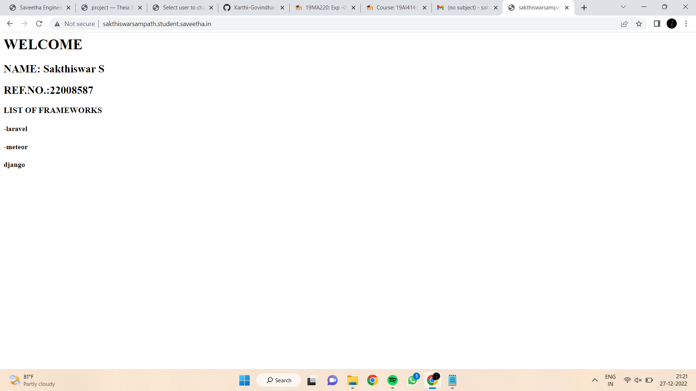

# Developing a Simple Webserver

# AIM:

Name:SAKTHISWAR S SAMPATH
Ref.no:22008587

# DESIGN STEPS:

## Step 1:

HTML content creation is done

## Step 2:

Design of webserver workflow

## Step 3:

Implementation using Python code

## Step 4:

Serving the HTML pages.

## Step 5:

Testing the webserver

# PROGRAM:
... python
from http.server import HTTPServer, BaseHTTPRequestHandler

content = """
<html>
</head>
</head>
<body>
<h1>WELCOME</h1>
<h2>NAME: Sakthiswar S</h2>
<h2>REF.NO.:22008587</h2>
<h3>LIST OF FRAMEWORKS</h3>
<h4>-laravel</h4>
<h4>-meteor</h4>
<h4>django</h4>
</body>
</html>
"""

class Hellohandler(BaseHTTPRequestHandler):
    def do_GET(self):
        self.send_response(200)
        self.send_header('Content-type','text/html; charset=utf-8')
        self.end_headers()
        self.wfile.write(content.encode())
server_address = ('',80)
httpd = HTTPServer(server_address, Hellohandler)
httpd.serve_forever()
...

# OUTPUT:

# RESULT:

The program is executed succesfully
